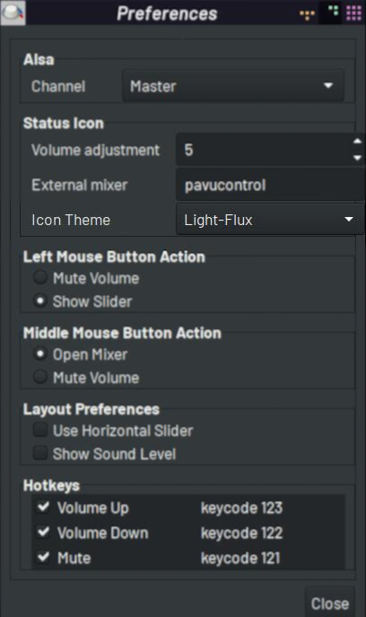

# Flux Theme for Volume Icon 0.4.6

## Details

A custom bars theme for Volume Icon 0.4.6

Speaker icon by [Freepik](https://www.flaticon.com/free-icons/speaker)

[Git repo](https://github.com/jdulloa/Flux-Theme-for-Volume-Icon)

## Preview

## How to install

1. Move the folders to the `Volume Icon` themes folder:

`sudo mv Dark-Flux Light-Flux /usr/share/volumeicon/icons`

2. Open `Volume Icon` Preferences:

3. Select the `Flux` theme variant of your choice from the `Icon Theme` dropdown list:

